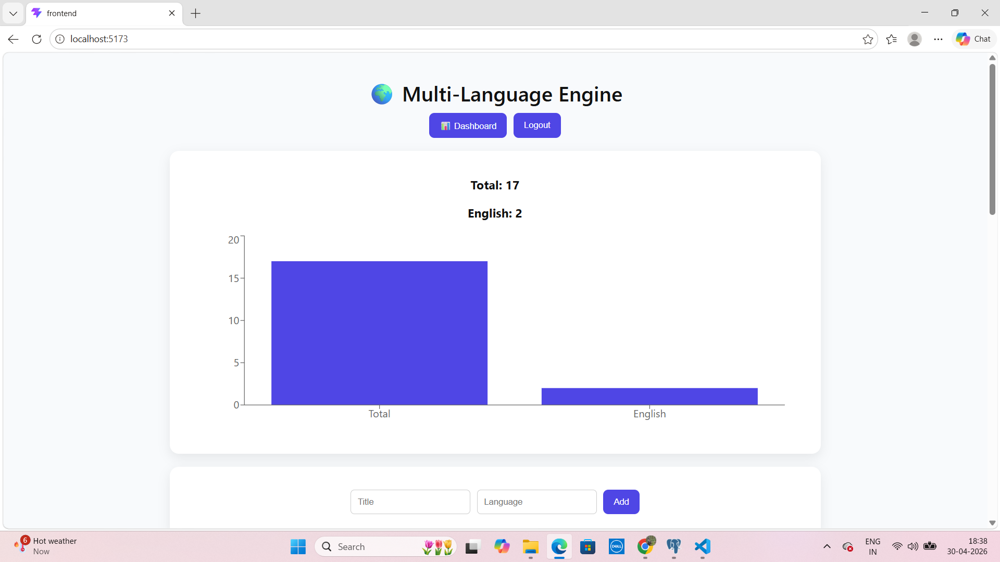
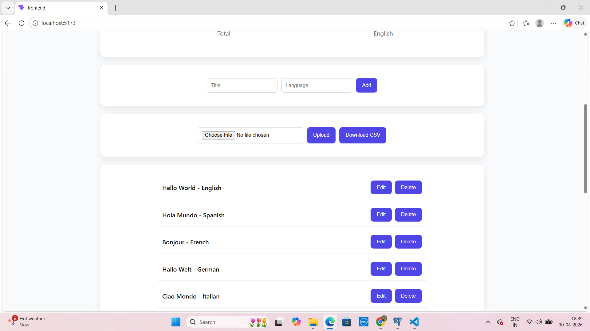
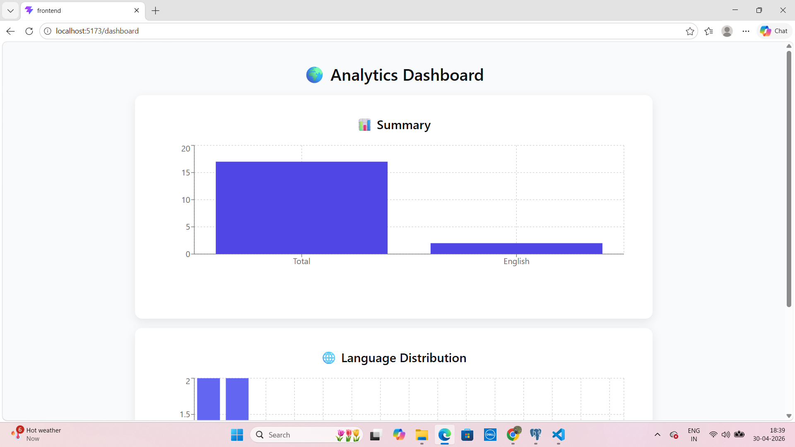
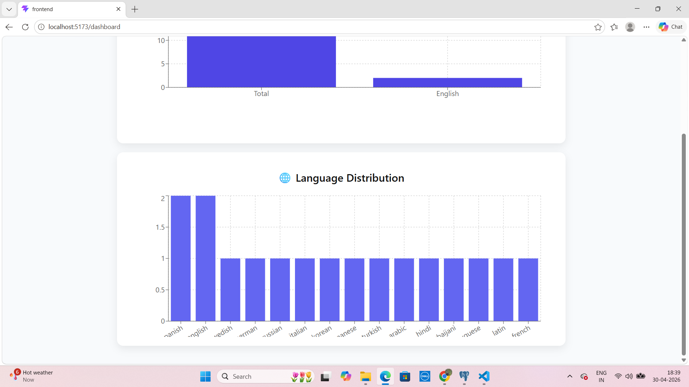

# 🌍 Multi-Language Support Engine

A **full-stack web application** for managing multi-language records, visualizing analytics, and performing CSV operations with secure authentication.

---

## 🚀 Project Overview

The **Multi-Language Support Engine** allows users to store, manage, and analyze text records across multiple languages.

It includes:

* Secure authentication (JWT)
* Full CRUD operations
* Interactive analytics dashboard
* CSV upload/download functionality

This project demonstrates real-world full-stack development using **Spring Boot + React**.

---

## 🛠️ Tech Stack

### 🔹 Backend

* Java 17
* Spring Boot
* Spring Security (JWT)
* Hibernate / JPA
* Flyway (Database Migration)
* PostgreSQL

### 🔹 Frontend

* React (Vite)
* Recharts (Data Visualization)
* CSS (Responsive UI)

---

## ✨ Features

### 🔐 Authentication

* User login using JWT
* Protected API endpoints

### 📋 Record Management

* Add records
* Edit records
* Delete records
* View all records

### 📊 Analytics Dashboard

* Total records count
* English records count
* Language distribution chart

### 📁 File Operations

* Upload CSV file
* Download records as CSV

### 📱 Responsive UI

* Works on mobile, tablet, and desktop

---

## 📸 Screenshots

### 🔐 Login Page



### 📋 Records Page



### 📊 Dashboard



### 🌐 Language Distribution



---

## ⚙️ Setup Instructions

### 🔧 Backend Setup

```bash
cd backend
./mvnw spring-boot:run
```

Backend runs on:

```
http://localhost:8080
```

---

### 💻 Frontend Setup

```bash
cd frontend
npm install
npm run dev
```

Frontend runs on:

```
http://localhost:5175
```

---

## 🔌 API Endpoints

### 🔐 Authentication

* `POST /api/auth/login`

### 📋 Records

* `GET /api/records`
* `POST /api/records`
* `PUT /api/records/{id}`
* `DELETE /api/records/{id}`

### 📊 Analytics

* `GET /api/records/stats`

### 📁 File Operations

* `POST /api/records/upload`
* `GET /api/records/export`

---

## 🧪 Testing

* Controller-level test cases implemented
* APIs tested using Postman

---

## 🔒 Security

* JWT-based authentication
* Protected routes
* Basic input validation

---

## 📈 Future Improvements

* Role-based authentication
* Search & filtering
* Pagination
* Dark mode UI

---

## 👩‍💻 Author

**Bhoomika N**

---

## 📌 Conclusion

This project demonstrates a complete **full-stack application** with authentication, CRUD operations, analytics, and responsive UI — making it suitable for real-world applications and technical evaluations.
